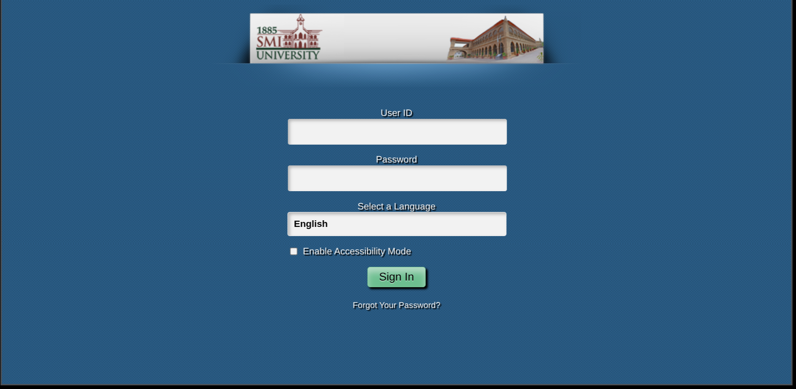

<div align="center">

# HTTP Credential Exposure Demo (SMIU CMS Case Study)




A controlled, local-only security awareness demonstration illustrating the risks associated with the **SMIU CMS** login portal (http://cms.smiu.edu.pk/) being served over unencrypted HTTP.

</div>

---

## The Problem: Real-World Case Study

This demo focuses on the SMIU CMS portal, which utilizes **HTTP** rather than mandatory HTTPS. This architectural flaw exposes users to:

| Vulnerability | Impact on SMIU Users |
|---|---|
| **Plaintext Transmission** | Student IDs and passwords sent without encryption. |
| **MITM Susceptibility** | Attackers on the university LAN can intercept traffic via ARP poisoning. |
| **Lack of HSTS** | Prevents the browser from enforcing a secure connection. |

### Educational Intent & Ethics
To ensure this project is strictly for **educational awareness** and cannot be mistaken for a phishing attempt:
1.  **Visual Distinction:** The UI has been intentionally modified to be **unidentical** to the live site.
2.  **Local Scope:** This tool is designed to run on `localhost` only.

---

## How It Works

This Flask server mimics the submission behavior of the CMS portal. When a user submits the demo form:
1. The request is sent to a local `/intercept` route.
2. The server parses the POST data (User ID/Password).
3. The UI displays the captured "plaintext" data to illustrate what a Man-in-the-Middle (MITM) attacker sees.

---

## Security Concepts Demonstrated

**HTTP vs HTTPS**
HTTP sends all data — including passwords — as plaintext. Anyone on the same network (café Wi-Fi, university LAN) can read it using tools like Wireshark.

**HSTS (HTTP Strict Transport Security)**
Without HSTS headers, a browser that previously visited a site over HTTPS can be tricked into connecting over HTTP by a MITM attacker. HSTS forces the browser to always use HTTPS for a domain.

**SSL Certificate Expiry**
When an SSL certificate expires, browsers display a warning. Users who click through expose themselves to attackers presenting forged certificates.

**Web Spoofing & Phishing via MITM**
On an unencrypted network, an attacker can serve a spoofed version of a legitimate login page. Without HTTPS and HSTS, the user has no way to verify authenticity.

---

## Getting Started

> ⚠️ Run only on your local machine in an isolated environment. Never deploy to a public server.

**1. Install dependencies**
```bash
pip install flask
```

**2. Run the server**
```bash
python server.py
```

**3. Open in browser**
```
http://127.0.0.1
```

**4. Submit the form** to see what a MITM attacker would intercept.

---

## Project Structure

```
http-credential-exposure-demo/
├── index.html       # Modified SMIU login form (Unidentical for ethics)
├── server.py        # Flask server
├── ps/
│   ├── images/      # SMIU assets used for educational context
│   ├── signin.css   # Stylesheet
│   └── signin.js

├── screenshots/
│   └── demo-login.png

└── README.md
```

---

## What This Is NOT

- A phishing tool
- A credential harvester
- An exploit targeting any real system or organization
- Intended for use outside of local, isolated environments

---

## Defensive Recommendations

If you manage a web application, ensure:

- [ ] All pages served over HTTPS
- [ ] HSTS header enabled with a long `max-age`
- [ ] SSL certificates renewed before expiry with auto-renewal (e.g. Let's Encrypt)
- [ ] HSTS preloading submitted to browser preload lists
- [ ] Login forms never accessible over HTTP under any condition

---

## License

Distributed under the [MIT License](LICENSE).

---

<div align="center">
<strong>Ethical hacking begins with ethics.</strong><br>
<em>This demo is a tool for better security, not for exploitation.</em>
</div>
